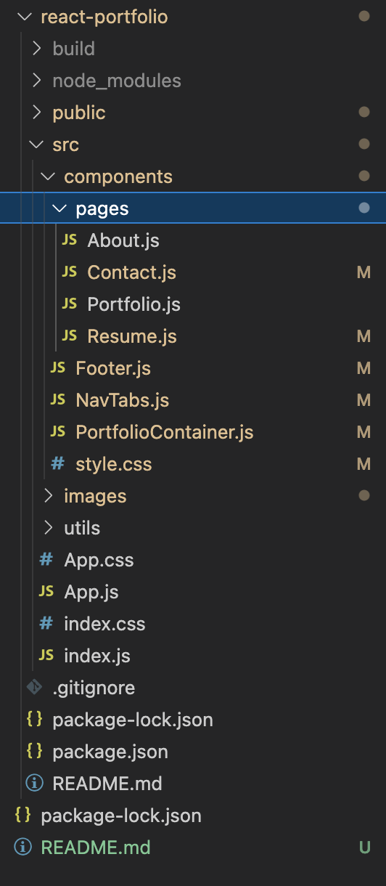
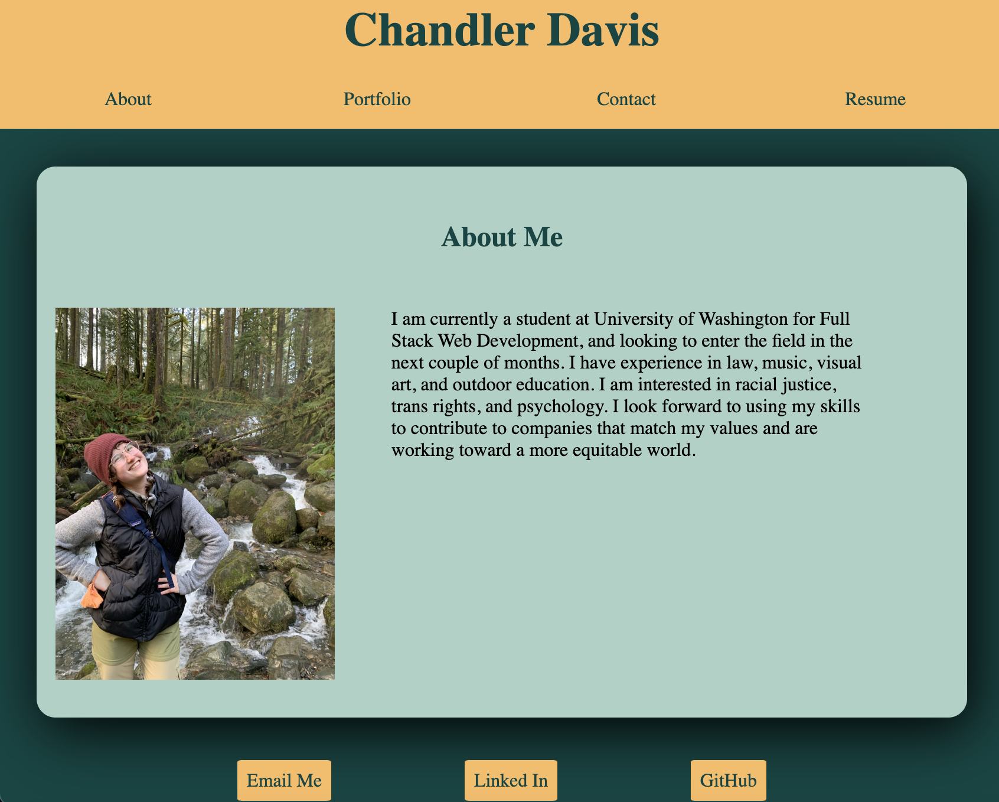

# Chandler_Portfolio

**What does this application do and why?**

* Gives a photo and brief description of me and my employment. 
* Links to projects I have completed or contributed to
* Links to my email and other contact information

**How the application is organized**

Chandler's Portfolio is organized into the following files: 

<!-- **Step-by-Step on how to run the application** -->
**What the application looks like**

**Link to deployed version of Chandler's Portfolio**

Website: https://echandlerdavis.github.io/React-Portfolio/
GitHub Repository: https://github.com/echandlerdavis/React-Portfolio

**Technologies Used** 

* html
* css
* flexbox
* react

